# Derivatives Analyst Simulation

A self-directed, 8-week program modelling the workflow of a junior 
derivatives analyst. Built to develop hands-on competency in options 
pricing, risk analysis, and structured products — grounded in real 
market data and reviewed with structured feedback.

**Target role:** Structured Products / Derivatives Analyst  
**Timeline:** [6 May 2026] → [5 July 2026 (tentative)]  
**Stack:** Python · Jupyter · NumPy · Pandas · Matplotlib

---

## Skill progression

---

## Progress

| Week | Theme | Status | Artifact |
|------|-------|--------|----------|
| 0 | Setup & environment | 🔄 In progress | — |
| 1 | Market orientation | ⬜ Not started | — |
| 2 | Options fundamentals | ⬜ Not started | — |
| 3 | Black-Scholes pricer | ⬜ Not started | — |
| 4 | The Greeks | ⬜ Not started | — |
| 5 | Structured products | ⬜ Not started | — |
| 6 | Stress testing | ⬜ Not started | — |
| 7 | Client communication | ⬜ Not started | — |
| 8 | Capstone | ⬜ Not started | — |

---

## About
Built as an alternative to waiting around for internship opportunities — 
practising real workflows, with real data, and structured feedback.